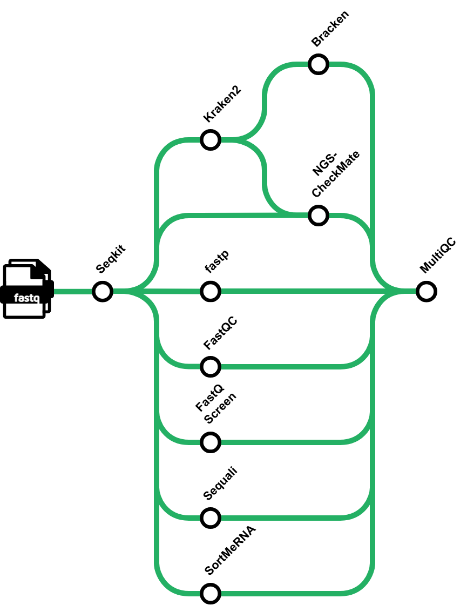

# TRON/qcpanda

[](https://github.com/TRON-Bioinformatics/qcpanda/actions/workflows/nf-test.yml)
[](https://github.com/TRON-Bioinformatics/qcpanda/actions/workflows/linting.yml)
[](https://www.nf-test.com)

[](https://www.nextflow.io/)
[](https://github.com/nf-core/tools/releases/tag/4.0.1)
[](https://docs.conda.io/en/latest/)
[](https://www.docker.com/)
[](https://sylabs.io/docs/)
[](https://cloud.seqera.io/launch?pipeline=https://github.com/TRON/qcpanda)

## Introduction

**TRON/qcpanda** is a bioinformatics pipeline for comprehensive quality control of both paired-end and single-end FASTQ data. It performs read sanitisation, adapter trimming, contamination screening against multiple reference genomes, rRNA quantification, taxonomic classification with abundance estimation, and optional sample identity verification. Results from all tools are aggregated into a single interactive MultiQC report including organism composition Sankey plots and custom NGSCheckMate plots.

<!--  -->


The pipeline executes the following steps. Steps marked _optional_ are skipped unless the corresponding parameter is supplied:

1. Sanitise reads ([`SeqKit Sana`](https://bioinf.shenwei.me/seqkit/)) — _optional_
2. Compute read statistics ([`SeqKit Stats`](https://bioinf.shenwei.me/seqkit/)) and filter samples below a minimum read count threshold
3. Repair unequal R1/R2 read counts ([`SeqKit Pair`](https://bioinf.shenwei.me/seqkit/)) — _optional_, paired-end only
4. Read quality control ([`FastQC`](https://www.bioinformatics.babraham.ac.uk/projects/fastqc/)) — _optional_
5. Adapter trimming and quality filtering ([`fastp`](https://github.com/OpenGene/fastp)) — _optional_
6. Comprehensive per-sample QC reporting ([`Sequali`](https://github.com/rhpvorderman/sequali)) — _optional_
7. Multi-genome contamination screening ([`FastQ Screen`](https://www.bioinformatics.babraham.ac.uk/projects/fastq_screen/)) — _optional_
8. rRNA contamination quantification ([`SortMeRNA`](https://github.com/biocore/sortmerna)) — _optional_
9. Taxonomic classification ([`Kraken2`](https://github.com/DerrickWood/kraken2)) with species abundance estimation ([`Bracken`](https://github.com/jenniferlu717/Bracken)) and interactive Sankey plots — _optional_
10. Sample identity verification ([`NGSCheckMate`](https://github.com/parklab/NGSCheckMate)) — _optional_
11. Aggregate QC report ([`MultiQC`](http://multiqc.info/))

## Usage

> [!NOTE]
> If you are new to Nextflow and nf-core, please refer to [this page](https://nf-co.re/docs/get_started/environment_setup/overview) on how to set-up Nextflow. Make sure to [test your setup](https://nf-co.re/docs/get_started/run-your-first-pipeline) with `-profile test` before running the workflow on actual data.

First, prepare a samplesheet with your input data that looks as follows:

`samplesheet.csv`:

```csv
sample,fastq_1,fastq_2
SAMPLE_PE1,SAMPLE_PE1_R1.fastq.gz,SAMPLE_PE1_R2.fastq.gz
SAMPLE_PE2,SAMPLE_PE2_R1.fastq.gz,SAMPLE_PE2_R2.fastq.gz
SAMPLE_SE1,SAMPLE_SE1_R1.fastq.gz,
```

Each row represents one sample. Paired-end samples require both `fastq_1` and `fastq_2`; single-end samples leave `fastq_2` empty. Paired-end and single-end samples can be mixed in the same samplesheet. See [`docs/usage.md`](docs/usage.md) for the full samplesheet specification.

Optionally, provide a patient–sample map to group samples by patient for NGSCheckMate analysis and plots:

`patient_map.tsv`:

```tsv
patient	sample
PATIENT_01	SAMPLE_PE1
PATIENT_01	SAMPLE_PE2
PATIENT_02	SAMPLE_SE1
```

Now, you can run the pipeline using:

```bash
nextflow run TRON/qcpanda \
   -profile <docker/singularity/.../institute> \
   --input samplesheet.csv \
   --outdir <OUTDIR> \
   --kraken2_db /path/to/kraken2_db \
   --bracken_db /path/to/bracken_db \
   --fastq_screen_references /path/to/fastq_screen_references.csv \
   --ngscm_snp_patternsfile /path/to/SNP.pt \
   --ngscm_patient_map patient_map.tsv
```

Use `-profile docker` or `-profile singularity` to run with containers (recommended). Other options include `conda`, `apptainer`, and institute-specific profiles. See the [nf-core docs](https://nf-co.re/docs/running/run-pipelines#profiles) for details.

> [!WARNING]
> Please provide pipeline parameters via the CLI or Nextflow `-params-file` option. Custom config files including those provided by the `-c` Nextflow option can be used to provide any configuration _**except for parameters**_; see [docs](https://nf-co.re/docs/running/run-pipelines#using-parameter-files).

## Credits

TRON/qcpanda was originally written by Patrick Sorn, Ivan Baksic, Johannes Hausmann, Jonas Ibn-Salem.

We thank the following people for their extensive assistance in the development of this pipeline:

- The [nf-core](https://nf-co.re) community for providing the pipeline template and shared infrastructure.

## Contributions and Support

If you would like to contribute to this pipeline, please see the [contributing guidelines](docs/CONTRIBUTING.md).

## Citations

An extensive list of references for the tools used by the pipeline can be found in the [`CITATIONS.md`](CITATIONS.md) file.

This pipeline uses code and infrastructure developed and maintained by the [nf-core](https://nf-co.re) community, reused here under the [MIT license](https://github.com/nf-core/tools/blob/main/LICENSE).

> **The nf-core framework for community-curated bioinformatics pipelines.**
>
> Philip Ewels, Alexander Peltzer, Sven Fillinger, Harshil Patel, Johannes Alneberg, Andreas Wilm, Maxime Ulysse Garcia, Paolo Di Tommaso & Sven Nahnsen.
>
> _Nat Biotechnol._ 2020 Feb 13. doi: [10.1038/s41587-020-0439-x](https://dx.doi.org/10.1038/s41587-020-0439-x).
